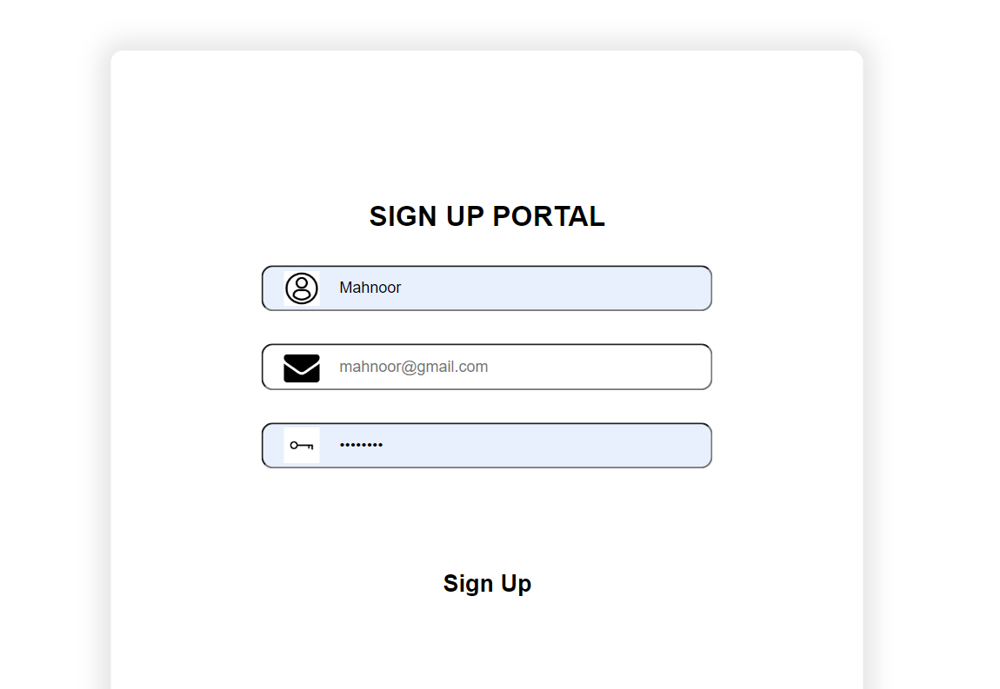

# Sign Up Form

Sign up is an action to register yourself for a new account. Different web portals might use different terms for returning users but they all use “sign up” for the process of first time registration. It simply means to create a new account – be it a portal, application, or newsletter.
  
I created a <strong>SIGN UP PORTAL</strong> manually through DJANGO (framework of Python).

### AUTHOR

Mahnoor Rana

You can get in touch with me on my LinkedIn Profile:

You can also follow my GitHub Profile to stay updated about my latest projects:

If you liked the repo then kindly support it by giving it a star ⭐.